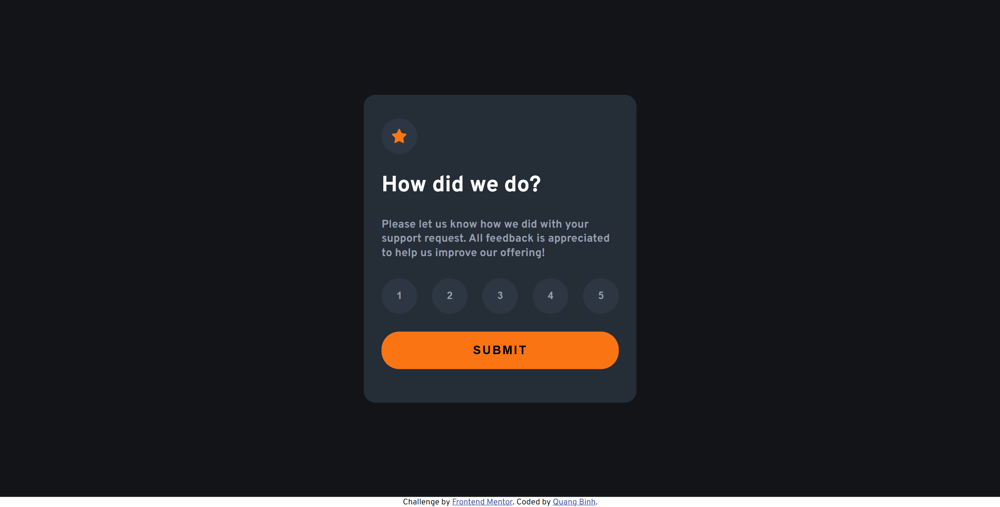

# Frontend Mentor - Interactive rating component solution

This is a solution to the [Interactive rating component challenge on Frontend Mentor](https://www.frontendmentor.io/challenges/interactive-rating-component-koxpeBUmI). Frontend Mentor challenges help you improve your coding skills by building realistic projects. 

## Table of contents

- [Overview](#overview)
  - [Screenshot](#screenshot)
  - [Links](#links)
- [My process](#my-process)
  - [Built with](#built-with)
  - [What I learned](#what-i-learned)
  - [Continued development](#continued-development)
  - [AI Collaboration](#ai-collaboration)
- [Author](#author)
- [Acknowledgments](#acknowledgments)

## Overview

### Screenshot

### Links

- Solution URL: [Solution here](https://github.com/nqbinh98/interactive-rating-component)
- Live Site URL: [Live site here](https://nqbinh98.github.io/interactive-rating-component/)

## My process

### Built with

- Semantic HTML5 markup
- CSS custom properties
- Flexbox
- Mobile-first workflow

### What I learned
I gained hands-on experience in managing DOM state transitions, implementing event delegation for interactive buttons, and ensuring keyboard accessibility with :focus states and ARIA attributes.

### Continued development
I plan to explore integrating a backend service to store ratings and refining component-based architecture using modern frameworks like React for more complex projects.

### AI Collaboration
Collaborated with an AI assistant to refine the code logic, implement best practices for accessibility (ARIA), and troubleshoot responsive layout issues.

## Author

- Website - [@nqbinh98](https://github.com/nqbinh98)
- Frontend Mentor - [@nqbinh98](https://www.frontendmentor.io/profile/nqbinh98)

## Acknowledgments
Thanks to the Frontend Mentor community for providing the design assets and the challenge platform.

